# Agricultural Productivity Analytics using AWS, Snowflake & Power BI
---

## Dashboard Link  

**Live Report:**  
https://app.powerbi.com/view?r=eyJrIjoiNGVjYTkzNjEtNzU1ZS00Zjg5LWFmNzAtOGY4NDIyYzE1ZjlmIiwidCI6ImNlOTAwODg5LTY5NTctNDJlMy04NWNlLTQwNTQyMzZiNjNiZCJ9  

---

## Project Overview  

This project analyzes agricultural productivity by evaluating environmental factors such as rainfall, temperature, humidity, irrigation type, soil characteristics, seasons, and yearly performance.

The objective is to build a secure end-to-end cloud data pipeline integrating AWS S3, Snowflake, and Power BI to enable data-driven agricultural decision-making.

---

## Architecture Overview  

Amazon S3 (Raw Dataset)  
→ AWS IAM Role (Secure Access Control)  
→ Snowflake Storage Integration  
→ External Stage  
→ Data Transformation (SQL)  
→ Power BI Dashboard  

---

## Tech Stack  

| Layer | Technology |
|-------|------------|
| Data Storage | Amazon S3 |
| Access Management | AWS IAM |
| Data Warehouse | Snowflake |
| Data Transformation | Snowflake SQL |
| Visualization | Power BI Desktop |
| Deployment | Power BI Service |
| Analytics | DAX |

---

# AWS Setup

### 1. S3 Bucket Creation

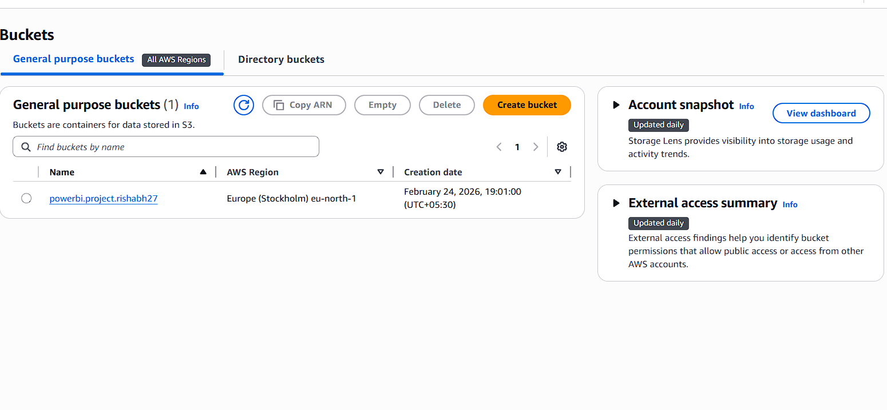

### 2. Dataset Object Uploaded

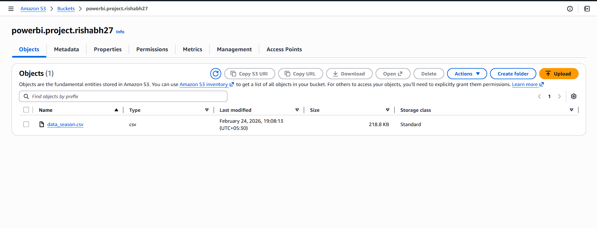

### 3. IAM Role Configuration

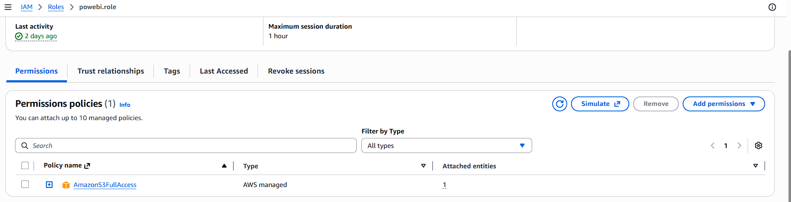

### 4. IAM Trust Relationship

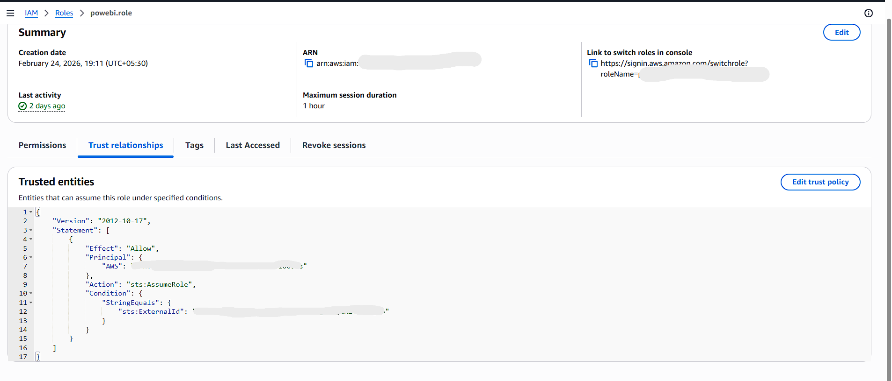

This ensures secure cross-service authentication between Snowflake and AWS.

---

# Snowflake Implementation

### 1. Storage Integration

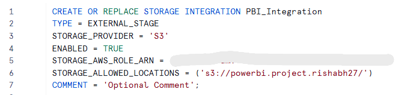

### 2. Stage Creation

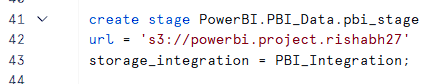

### 3. Data Loading (COPY INTO)

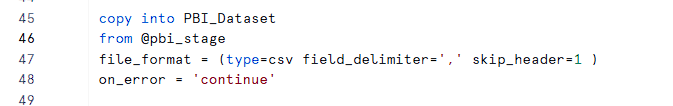

### 4. Aggregation Query Validation

### 5. Year Group Transformation

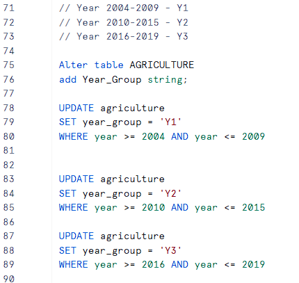

### 6. Rainfall Group Transformation

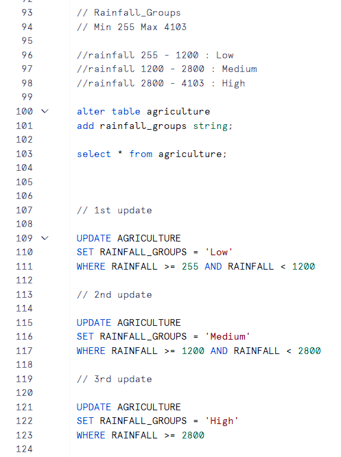

---

# Data Engineering Pipeline  

1. Created Amazon S3 bucket and uploaded raw dataset  
2. Configured IAM Role for Snowflake–S3 secure integration  
3. Created storage integration object in Snowflake  
4. Created external stage referencing S3  
5. Loaded dataset into Snowflake warehouse  
6. Performed validation and aggregation checks  
7. Implemented Year Group transformation  
8. Implemented Rainfall classification logic  
9. Connected Snowflake to Power BI  
10. Built interactive multi-page dashboard  
11. Published report to Power BI Service  

---

# Power BI Dashboard  

## Rainfall Analysis

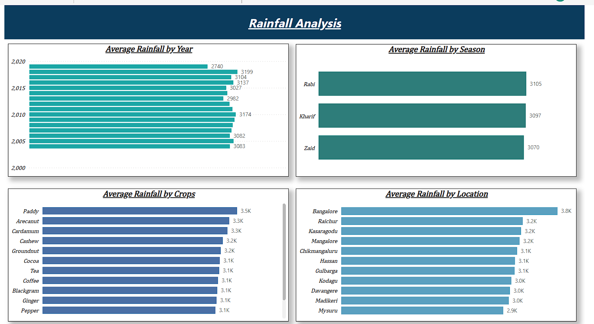

## Temperature Analysis

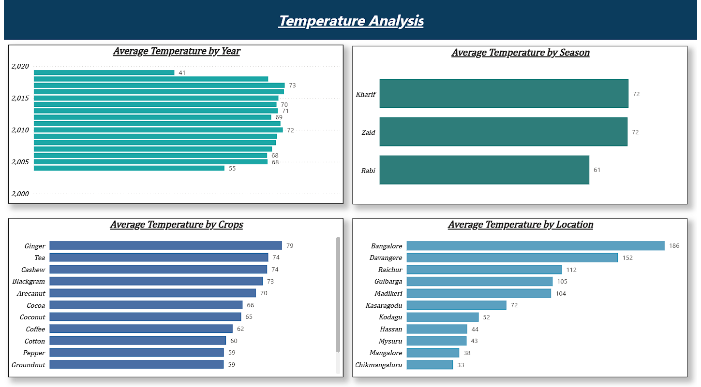

## Humidity Analysis

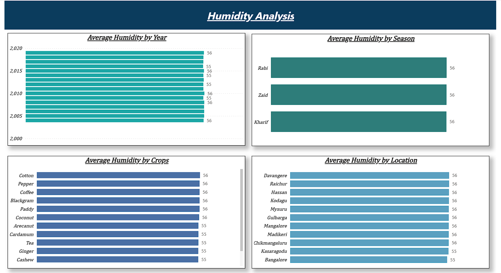

## Yield Analysis

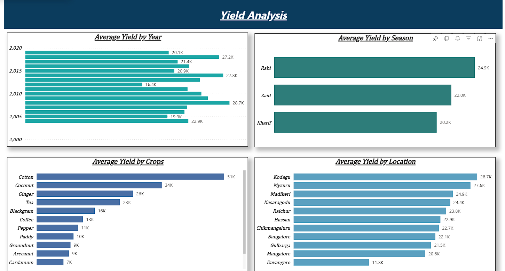

---

# Key Insights  

### 1. Crop Yield Analysis  

- Highest Yielding Crop: **Cotton (~51K)**  
- Second Highest: **Coconut (~34K)**  
- Third Highest: **Ginger (~26K)**  
- Lowest Yielding Crop: **Cardamom (~7K)**  

Cotton significantly outperforms other crops in overall productivity.

---

### 2. Year-wise Yield Trend  

- Peak Yield: **2010 (~28.7K)**  
- Major Drop: **2015 (~16.4K)**  
- Recovery observed in later years (~27.8K)**  

Agricultural productivity shows strong year-to-year fluctuations.

---

### 3. Regional Performance  

- Top Performing Region: **Kodagu (~28.7K)**  
- Followed by: Mysuru and Madikeri  
- Lowest Performing Region: **Davangere (~11.8K)**  

Regional environmental conditions strongly influence yield.

---

### 4. Seasonal Performance  

- Highest Yield: **Rabi (~24.9K)**  
- Moderate: Zaid (~22.0K)  
- Lower: Kharif (~20.2K)**  

Season selection plays a major role in maximizing productivity.

---

### 5. Environmental Impact  

- Rainfall shows moderate association with yield  
- Temperature alone does not guarantee higher productivity  
- Humidity variation remains stable (~55–56)**  

Yield depends on multi-factor environmental interaction.

---

# Project Outcome  

This project demonstrates:

- End-to-end cloud-based data pipeline  
- Secure AWS–Snowflake integration  
- SQL-driven feature engineering  
- DAX-based analytical modeling  
- Multi-page interactive dashboard  
- Insight extraction for strategic agricultural planning
